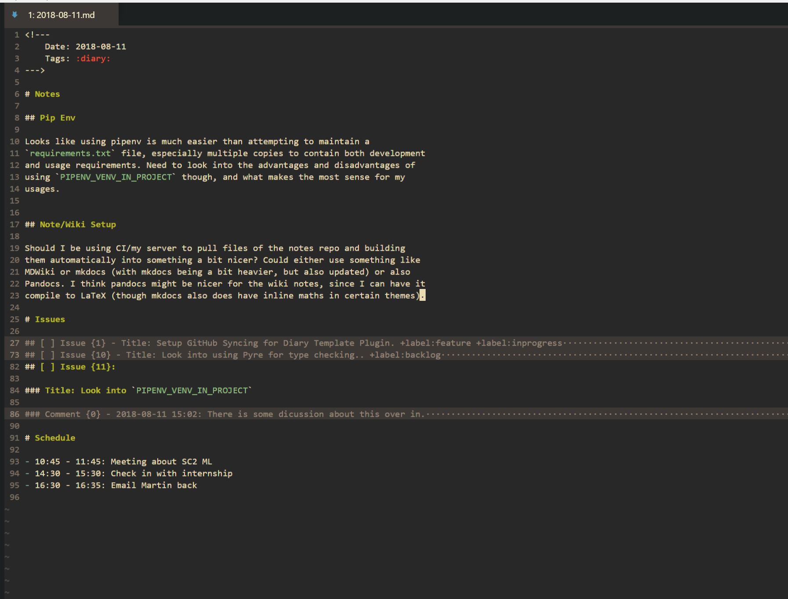

# Nvim Diary Template

<p align="center">
<a href="https://travis-ci.org/CrossR/nvim_diary_template"></a>
<a href="https://codecov.io/gh/CrossR/nvim_diary_template"></a>
<a href="https://github.com/ambv/black"></a>
</p>

Test repo for a plugin to generate a suitable template for a markdown diary
(for me). This was mainly made to let me mess with various Python features,
like the NeoVim API, poetry, mypy and more, there is a million and one
simpler ways to achieve this. The README here currently mainly stands more to
give myself a reminder where and how things are setup.

## Features:
- Google Calendar Integration:
    - Make a Diary entry, and have it auto-populated with todays events
      from GCal.
    - Any new events that are added, can be synced to GCal.
    - Deoplete source for calendar names to specify which calendar to be used.
    - **TODO**: Add rename and remove syntax, such that events can be removed
      or edited.
- GitHub Issues Integration:
    - Use a Private repo on GitHub as an issue tracker, synced with your text
      diary. This is useful for ToDos, as well as keeping logs of how the todos
      are progressing.
    - Issues you make online and in-diary are synced, along with all
      comments.
    - Support for Github labels (including Deoplete source), including sorting
      by labels.
- Diary outline generation:
    - Builds a diary file with metadata in and the defined headings.

## Screenshot:



The diary file is auto-populated with the days Google Calendar events, as
well as any open issues from the repo that the plugin is connected to. The
issues are folded (twice, once for the issue itself, and once for each
comment) and can be edited and uploaded back to GitHub. They may also be
sorted depending on their urgency.

## Config:

Install with `vim-plug` like so, as well as ensuring the python env used with
Neovim has the required packages.

```viml
Plug 'CrossR/nvim_diary_template', { 'do': ':UpdateRemotePlugins' }
```

### Basics:

Add the following to  your `init.vim`, which sets the location of your
notes and the location of your config.

```viml
let g:nvim_diary_template#notes_path = "some/path/wiki/docs/"
let g:nvim_diary_template#config_path = "some/path/wiki/config/"

" If you don't want GCal or GitHub integration.
let g:nvim_diary_template#use_github_repo = 0
let g:nvim_diary_template#use_google_calendar = 0
```

Google Calendar and GitHub integration need a bit of manual work to get them
setup, which is outlined below.

### GitHub

Generate an access token at Settings > Developer Settings > Personal access
tokens on GitHub. Put this generated token in your config folder, in a json file
called `github_credentials.json` with the structure:

```json
{"access_token": "XXX"}
```

Once this is added, add the following to your `init.vim`, to tell the plugin
where your GitHub repo is:

```viml
let g:nvim_diary_template#repo_name = 'CrossR/nvim_diary_template'
```

Now, when generating a diary, all issues should be pulled in.

### Google

This requires a few things, so a script (`generate_google_credentials.py`)
is included, to help produce the correct auth file.

First, generate a set of API keys on the [Google API
Dashboard](https://console.developers.google.com).
This is done by making a new project, then making a new set of credentials under
"Credentials". After giving it any name, download the config file and rename it
to `client_secret.json`, before running the included
`generate_google_credentials.py` script on it, to make the final authentication
file. This final `credentials.json` should then be put in your config folder.

Now, just add the following to your `init.vim` to configure the plugin to use
Google Calendar:

```viml
" This sets the calendar the plugin will use, and must already exist.
let g:nvim_diary_template#google_cal_name = 'NVim Notes'

" This is an array that lets you ignore certain calendars.  It may be easiest
" to sync once, then check the calendar names from the cache file (in the config
" folder) to set this array.
let g:nvim_diary_template#calendar_filter_list = ['Holidays in United Kingdom']
```

### Other options

The expected time zone for both issues and calendar events can be set with:

```viml
let g:nvim_diary_template#timezone = 'Europe/London'
```

The heading list (outside of Issues and Schedule), can be set with:

```viml
let g:nvim_diary_template#daily_headings = ["Notes", "Meetings"]
```

The issue sort order is based on the labels that a given issue has, as well
as the completion state. The highest number for a given issue is used to sort
it.

The `issue.complete` value is assigned to any completed issue.

Issues are sorted such that the lower the score, the higher it appears on the
list. That is, with the default settings, completed issues are at the bottom
and in progress issues are at the top.

```viml
let g:nvim_diary_template#sort_order = {
            \ "issue.complete": 10000,
            \ "backlog": 5000,
            \ "blocked": 1000,
            \ "default": 100,
            \ "inprogress": 0,
            \ }
```

The issue grouping (i.e. add a subheading under issues for certain issues, and
"Other" for the remaining) can be set with

```viml
let g:nvim_diary_template#issue_groups = ['work', 'personal']
```
